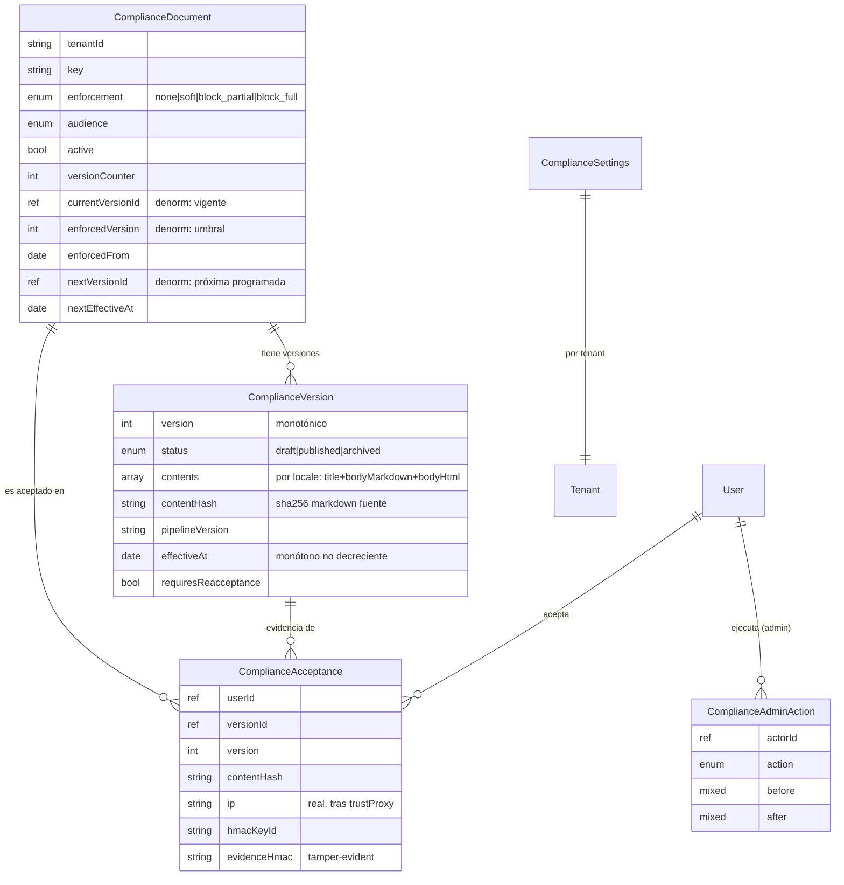
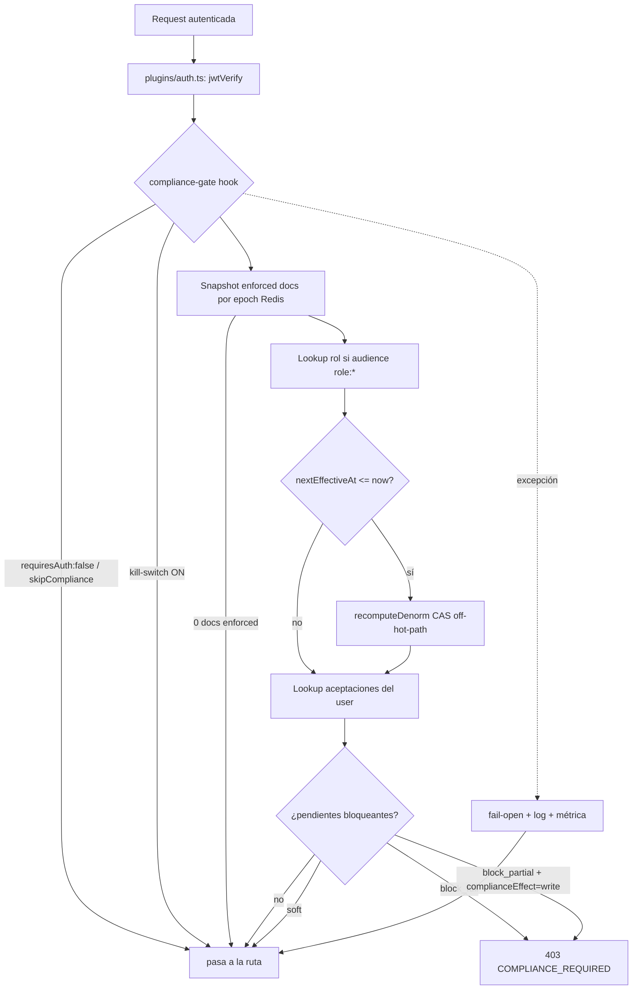
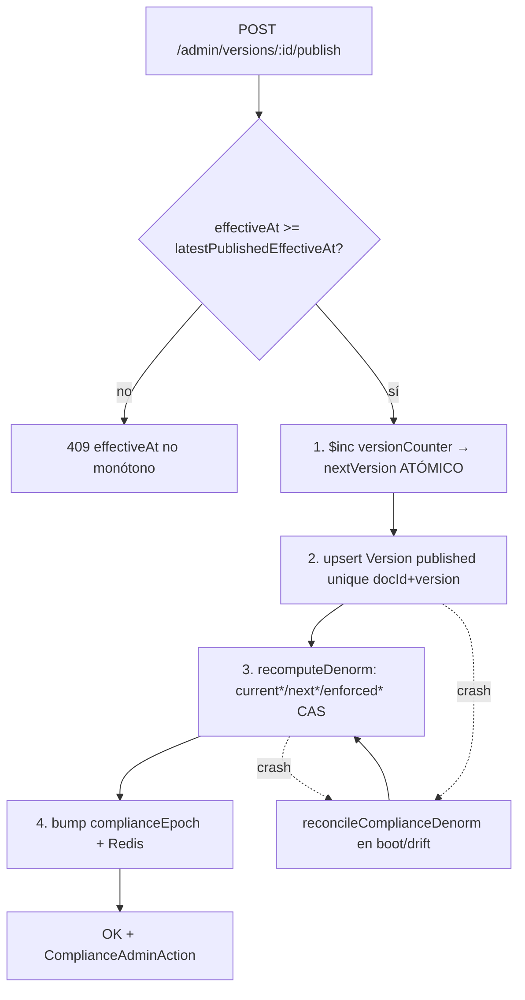
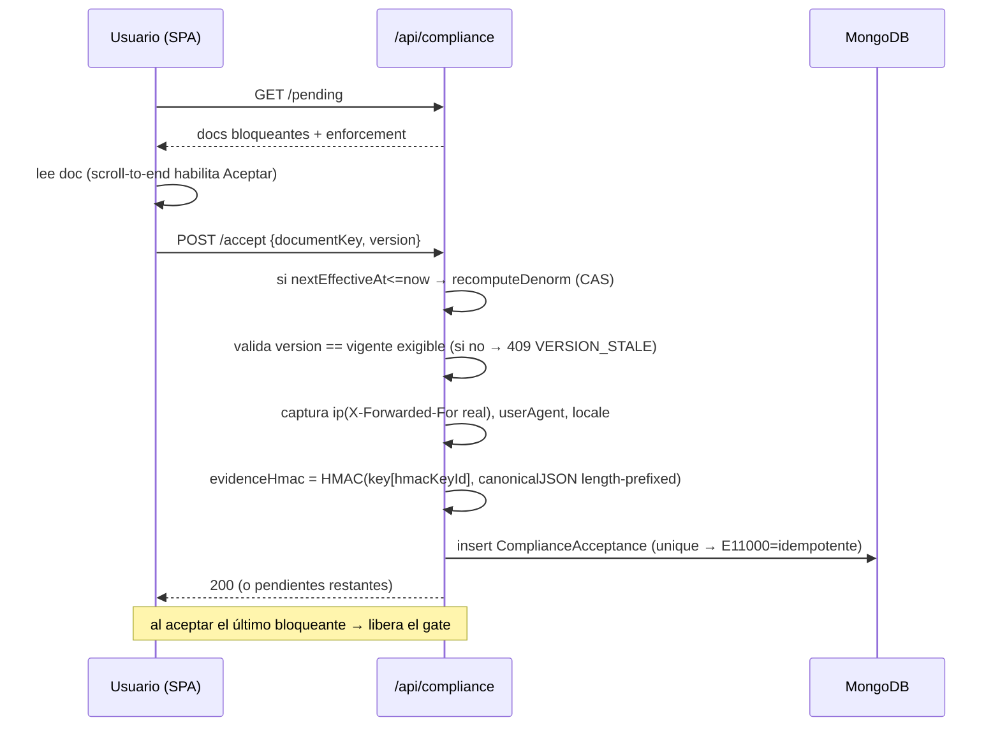
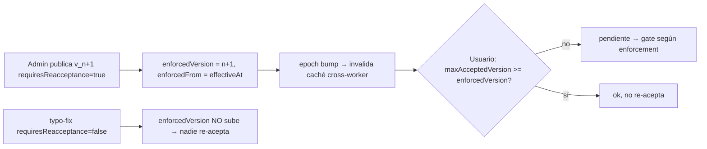

# BifrostMail Compliance Framework — Diagramas de Arquitectura

Complementa `DESIGN.md` (v4). Diagramas Mermaid de modelo de datos, gating, publish y aceptación.

## 1. Modelo de datos (ER)

## 2. Gate de primer acceso (request flow)

## 3. Publish (standalone-safe, sin transacción multi-doc)

## 4. Aceptación + evidencia HMAC

## 5. Reaceptación por nueva versión

