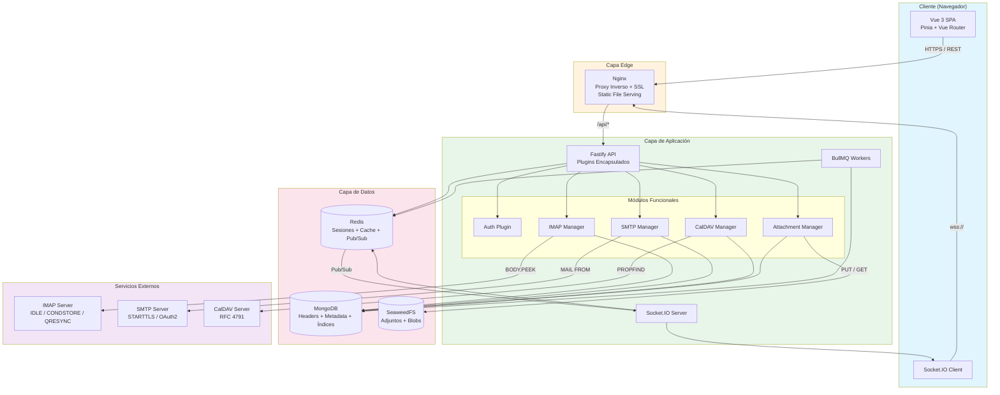

## 4. Arquitectura de Sistema

La arquitectura de Webmail 6.0 se fundamenta en un patrón de Backend-for-Frontend (BFF) con cinco pilares tecnológicos: una SPA en Vue 3 como capa de presentación, Nginx como proxy inverso y servidor de estáticos, Fastify como runtime del API, MongoDB como sistema de registro principal con Redis para caché y sesiones, y SeaweedFS como almacén de objetos para adjuntos. El diseño prioriza la separación de responsabilidades entre la indexación local de headers (operaciones rápidas sobre MongoDB) y la obtención bajo demanda de cuerpos de email vía IMAP, un patrón que la investigación identificó como crítico para alcanzar tiempos de carga sub-segundo en buzones grandes [^70^][^75^]. La decisión de adoptar Fastify sobre Express se fundamenta en benchmarks controlados que muestran un rendimiento 2-3x superior: aproximadamente 14,460 req/s frente a 6,150 req/s bajo 100 conexiones concurrentes durante 10 segundos [^130^]. Adicionalmente, el sistema de plugins de Fastify proporciona encapsulación nativa — cada plugin opera con su propio scope, evitando que decoradores y middlewares se filtren entre rutas — lo cual resulta particularmente valioso para aislar los módulos de IMAP, SMTP, CalDAV y WebSocket [^128^].

### 4.1 Diagrama de Arquitectura

La topología del sistema sigue un flujo unidireccional de peticiones desde el navegador hasta los servicios externos, con canales paralelos para notificaciones en tiempo real y procesamiento en segundo plano. El siguiente diagrama describe la interacción completa entre componentes:



El diagrama revela una decisión arquitectónica intencional: MongoDB actúa exclusivamente como índice local de headers y metadata, mientras que los cuerpos de email permanecen en el servidor IMAP hasta que el usuario solicita su lectura. Esta estrategia *headers-first, body-on-demand* reduce drásticamente el ancho de banda necesario para la sincronización inicial y permite que la lista de mensajes se sirva enteramente desde la base de datos local en tiempos de respuesta inferiores a 100ms [^70^][^75^]. El uso de BODY.PEEK en lugar de BODY para el fetch de headers evita marcar implícitamente los mensajes como \\Seen, preservando el estado de lectura del usuario hasta que interactúa explícitamente con un email [^70^][^78^].

### 4.2 Flujos de Datos Principales

Cada operación crítica del webmail sigue un pipeline definido que equilibra latencia percibida, uso de ancho de banda y consistencia de datos. A continuación se detallan los seis flujos fundamentales.

#### 4.2.1 Login: Validación IMAP → JWT + Credenciales Encriptadas → Conexión IMAP en Pool

El flujo de autenticación implementa el patrón BFF (Backend-for-Frontend) con token rotation, considerado el estándar para aplicaciones web en 2026 [^157^][^160^]. El proceso consta de cinco etapas:

1. **Validación de credenciales contra IMAP**: El frontend envía email y password al endpoint POST /api/auth/login. Fastify intenta una conexión IMAP transitoria usando imapflow con los parámetros del servidor configurado. Si la conexión IMAP es exitosa, las credenciales se consideran válidas. Esta decisión — validar contra el servidor IMAP real en lugar de mantener una tabla local de passwords — elimina la necesidad de sincronización de credenciales y garantiza que el usuario siempre tenga acceso activo a su cuenta de correo.

2. **Encriptación de credenciales**: El password se encripta con AES-256-GCM usando una clave maestra derivada de `ENCRYPTION_KEY` (variable de entorno del servidor). El plugin mongoose-aes-encryption proporciona esta encriptación transparente a nivel de campo: la aplicación lee y escribe valores en texto plano mientras solo el ciphertext toca la base de datos [^154^]. El documento resultante se almacena en la colección `accounts`.

3. **Emisión de tokens JWT**: Se genera un access token (JWT firmado, expiración 15 minutos) y un refresh token (UUID aleatorio, expiración 7 días). El access token se devuelve en el cuerpo de la respuesta para almacenamiento en memoria del frontend; el refresh token se almacena en Redis con TTL de 7 días y se entrega al cliente como cookie HTTP-only con atributos `Secure`, `SameSite=Strict` [^157^].

4. **Pool de conexiones IMAP**: Tras el login exitoso, el IMAP Manager inicializa una conexión persistente al servidor IMAP y la registra en un pool singleton por cuenta de usuario. El pool gestiona reconexiones automáticas, mailbox locking para acceso concurrente seguro, y expiración de conexiones inactivas tras 5 minutos [^137^][^39^]. imapflow maneja automáticamente extensiones IMAP como CONDSTORE, QRESYNC, IDLE y COMPRESS [^1^].

5. **Sincronización inicial en background**: Se encola un job en BullMQ para sincronización de folders y headers. El usuario puede navegar inmediatamente mientras el worker procesa la sincronización en segundo plano [^203^].

| Componente | Decisión Arquitectónica | Justificación |
|------------|------------------------|---------------|
| Validación de credenciales | Conexión transitoria IMAP en login | Elimina sincronización de passwords; garantiza acceso activo |
| Encriptación | AES-256-GCM a nivel de campo vía mongoose-aes-encryption | Protege PII incluso si la base de datos se compromete [^154^] |
| Access token | JWT en memoria frontend, TTL 15 min | Minimiza superficie de ataque XSS; no se almacena en localStorage |
| Refresh token | UUID en Redis + HTTP-only cookie | Prevención de token theft; rotación en cada uso [^157^] |
| Pool IMAP | Singleton con expiración 5 min | Evita límites de conexiones de providers (Gmail: 250, Outlook: 20) [^137^] |

#### 4.2.2 Sincronización Inicial: FETCH Headers → Indexado en MongoDB

La sincronización inicial constituye el momento de mayor carga del sistema y define la primera impresión del usuario sobre la velocidad del webmail. El pipeline opera en cuatro fases:

1. **Descubrimiento de folders**: El worker de BullMQ ejecuta LIST contra el servidor IMAP para obtener la jerarquía completa de carpetas. Se almacenan en la colección `folders` con sus atributos (\\HasNoChildren, \\Sent, \\Trash, etc.) y el uidvalidity actual.

2. **Fetch de headers en batch**: Para cada folder, se ejecuta UID FETCH con BODY.PEEK[HEADER.FIELDS (DATE FROM TO CC SUBJECT MESSAGE-ID IN-REPLY-TO REFERENCES CONTENT-TYPE X-PRIORITY)] en lotes de 500 mensajes. Esta selección de headers es suficiente para construir la lista de emails, identificar threading y extraer preview, sin incurrir en el costo de transferir cuerpos completos [^70^].

3. **Parseo MIME y enriquecimiento**: Cada lote de headers se procesa con PostalMime para extraer: remitente parseado (nombre + dirección), lista de destinatarios, asunto decodificado (RFC 2047), preview de texto (primeros 200 caracteres del body plain cuando está disponible), y flags IMAP. PostalMime — desarrollado por el mismo equipo de imapflow — ofrece protecciones de seguridad integradas como `maxNestingDepth` y `maxHeadersSize`, además de cero dependencias y soporte TypeScript nativo [^99^].

4. **Indexado en MongoDB**: Los documentos se insertan en la colección `emails` con un índice compuesto siguiendo la regla ESR (Equality → Sort → Range): `{accountId: 1, folderId: 1, date: -1, uid: 1}` [^204^]. Este índice optimiza la query más frecuente del sistema: listar emails de una carpeta ordenados por fecha. Para servidores que soportan CONDSTORE, se almacena además el `modseq` de cada mensaje, permitiendo sincronizaciones incrementales subsiguientes que solo descargan mensajes modificados [^39^].

El uso de BullMQ para orquestar este pipeline permite: retries con exponential backoff ante fallos transitorios de red, dead letter queues para mensajes que no pueden parsearse, y flow producers para modelar dependencias entre pasos [^203^].

#### 4.2.3 Navegación: Sirve desde MongoDB → Fallback a IMAP

Una vez completada la sincronización inicial, la navegación por el inbox opera casi exclusivamente contra MongoDB. El flujo es:

1. **Query a MongoDB**: El endpoint GET /api/emails recibe `accountId`, `folderId`, `page`, `limit`, `sort` (default: date desc) y `query` (búsqueda opcional). Se ejecuta una query con el índice compuesto que resuelve en menos de 50ms para buzones de hasta 100,000 mensajes.

2. **Búsqueda full-text**: Cuando el usuario introduce términos de búsqueda, MongoDB Atlas Search (basado en Apache Lucene) proporciona full-text search integrado sin infraestructura adicional, con sincronización automática de datos, highlighting, fuzzy search y autocomplete [^132^]. Atlas Search cubre aproximadamente el 90% de los casos de uso de búsqueda en webmail: full-text sobre asunto, cuerpo, remitente, filtrado por fecha/carpeta y autocomplete [^132^].

3. **Fallback a IMAP**: Si un folder no ha sido sincronizado (primer acceso) o la marca `needsResync` está activa, el sistema delega la query a imapflow con un timeout de 10 segundos. Los resultados se cachean en MongoDB para consultas subsiguientes. Este fallback garantiza que el usuario siempre vea datos, aunque con mayor latencia en el primer acceso a una carpeta.

4. **Virtual scrolling**: El frontend implementa virtual scrolling sobre la lista de emails, solicitando nuevas páginas vía paginación cursor-based (`lastDate` + `lastId`) en lugar de offset-based, evitando degradación de performance en páginas profundas [^148^].

#### 4.2.4 Lectura de Email: Trae Body de IMAP → Sanitiza HTML → Marca \\Seen

El flujo de lectura de un email individual ilustra el patrón *body-on-demand*:

1. **Comprobación de cache**: Al hacer clic en un email, el frontend solicita GET /api/emails/:id/body. El backend primero consulta Redis (patrón cache-aside): si el cuerpo está cacheado con TTL de 1 hora, se devuelve inmediatamente [^152^].

2. **Fetch del cuerpo vía IMAP**: En cache miss, se ejecuta UID FETCH con BODY.PEEK[] para obtener el mensaje completo en formato RFC 822. El uso de BODY.PEEK evita marcar el mensaje como \\Seen automáticamente [^70^][^78^]. El mensaje se parsea con PostalMime para extraer la parte HTML y la parte texto plano [^101^].

3. **Sanitización de HTML**: La parte HTML se procesa con DOMPurify en el servidor (entorno jsdom) para eliminar scripts, event handlers inline, elementos potencialmente peligrosos (object, embed, form con action javascript:) y atributos de estilo que puedan ejecutar código (expression, behavior). DOMPurify es el gold standard para sanitización HTML, identificado como la única defensa confiable contra vectores XSS vía contenido de email [^154^]. El HTML sanitizado se almacena en Redis con TTL de 1 hora.

4. **Marcado como leído**: Si el usuario permanece más de 3 segundos visualizando el email, el frontend envía una petición para marcar el mensaje como \\Seen. Esta operación se ejecuta vía IMAP STORE y se refleja en MongoDB actualizando el campo `flags`.

5. **Renderizado seguro en el cliente**: El HTML sanitizado se renderiza dentro de un iframe sandboxed con atributos `sandbox="allow-same-origin"` y una CSP estricta que bloquea scripts, plugins y navegación de top-level. Esta triple capa de sanitización (DOMPurify server-side + iframe sandbox + CSP headers) constituye la estrategia defense-in-depth contra ataques XSS vía email.

#### 4.2.5 Envío: Draft → Firma → SMTP → Copia en Sent → Borra Draft

El pipeline de envío de email asegura que ningún mensaje se pierda incluso ante fallos parciales:

1. **Composición y auto-save**: Mientras el usuario redacta, el frontend envía peticiones PATCH cada 10 segundos para actualizar el draft en MongoDB. Los drafts se almacenan en la colección `drafts` sin sincronización con el servidor IMAP hasta que el usuario envía.

2. **Preparación del mensaje**: Al pulsar "Enviar", el backend construye el mensaje MIME completo usando Nodemailer, incluyendo: headers In-Reply-To y References para mantener el thread (siguiendo el algoritmo JWZ) [^56^], firma HTML configurada por el usuario, y adjuntos referenciados por storageKey en SeaweedFS.

3. **Envío SMTP**: Nodemailer transmite el mensaje vía SMTP con STARTTLS y pooling de conexiones para mejor performance [^68^]. Para cuentas Gmail, se requiere autenticación OAuth2 (XOAUTH2) ya que Google eliminó completamente la autenticación básica en marzo de 2025 [^58^].

4. **Copia en Sent**: Tras confirmación de envío SMTP, se crea una copia en la carpeta Sent vía IMAP APPEND. EmailEngine demuestra que este patrón es robusto, construyendo automáticamente los headers necesarios y marcando flags IMAP apropiados [^60^].

5. **Limpieza**: Se elimina el draft de MongoDB y se encola un job para sincronizar la carpeta Sent, asegurando que la copia aparezca en el inbox del usuario.

#### 4.2.6 Auto-Save Draft: MongoDB cada 10 segundos

El auto-guardado de borradores es una operación crítica para la experiencia de usuario que debe ser rápida y fiable:

1. **Frecuencia**: El frontend envía el estado completo del draft (to, cc, bcc, subject, body, attachments) cada 10 segundos mientras el usuario está activo en el compositor, y al detectar el evento `beforeunload`.

2. **Storage**: Los drafts se almacenan exclusivamente en MongoDB (colección `drafts`) sin sincronización con el servidor IMAP. Esto evita crear mensajes de borrador temporales en la bandeja del usuario.

3. **Concurrencia**: Al abrir el compositor, se carga el draft más reciente desde MongoDB. Si existen múltiples borradores para una misma cuenta, se presentan en un selector lateral.

4. **Cleanup**: Los drafts no modificados en 30 días se eliminan automáticamente mediante un índice TTL en MongoDB sobre el campo `lastModifiedAt`.

### 4.3 Notificaciones en Tiempo Real

El sistema implementa un pipeline de notificaciones push dual: WebSocket como canal principal con IMAP IDLE como fuente de eventos, complementado por polling periódico como fallback para servidores sin soporte IDLE.

#### 4.3.1 IMAP IDLE → Redis Pub/Sub → WebSocket → Frontend

La arquitectura de notificaciones en tiempo real consta de cuatro capas conectadas:

1. **IMAP IDLE (capa de protocolo)**: Para cada cuenta conectada, imapflow mantiene una conexión IDLE activa en el folder INBOX. IMAP IDLE (RFC 2177) permite al servidor IMAP "empujar" notificaciones al cliente cuando llegan nuevos mensajes, eliminando la necesidad de polling constante [^63^]. Si el servidor no soporta IDLE, imapflow permite configurar `missingIdleCommand` con alternativas como NOOP, SELECT o STATUS [^41^]. La limitación de IDLE — solo una carpeta por conexión — se mitiga reiniciando IDLE periódicamente según `maxIdleTime` y rotando entre carpetas monitoreadas [^39^].

2. **Redis Pub/Sub (capa de mensajería)**: Cuando imapflow recibe una notificación de nuevo mensaje (o cambio de flags), el IMAP Manager publica un evento estructurado al canal Redis `notifications:{userId}`. Redis Pub/Sub distribuye el evento a todos los servidores WebSocket suscritos [^138^]. Aunque Pub/Sub es fire-and-forget (mensajes se evaporan si no hay suscriptores activos), esto es adecuado para notificaciones de email donde el objetivo es informar a sesiones activas, no persistir eventos históricos [^142^]. Para eventos críticos que no pueden perderse (como la llegada de un email que dispara una regla de forwarding), se utiliza Redis Streams con acknowledgment y replay [^142^].

3. **Socket.IO Server (capa de transporte)**: El servidor WebSocket se suscribe a los canales Redis de los usuarios con sesiones activas. Cuando recibe un evento, lo transmite a la room Socket.IO correspondiente al `userId`. Socket.IO se selecciona sobre `ws` nativo por su soporte de rooms (permitiendo notificaciones por usuario), auto-reconexión con backoff exponencial, y fallback transparente a HTTP long-polling cuando WebSocket no está disponible [^162^]. Aunque `ws` ofrece mayor rendimiento crudo (~45,493 msg/s vs ~27,152 msg/s de Socket.IO), las features adicionales de Socket.IO resultan críticas para la fiabilidad del canal de notificaciones en condiciones de red variables [^155^].

4. **Frontend (capa de consumo)**: El cliente Vue recibe eventos como `email:new`, `email:flagChanged`, `folder:countChanged` y actualiza el store Pinia correspondiente, reflejando los cambios en la UI sin necesidad de refresh. Los eventos de nuevo email desencadenan además una petición de sincronización incremental para obtener los headers del mensaje nuevo.

#### 4.3.2 Fallback Polling 30-60s

Para escenarios donde WebSocket no está disponible (redes corporativas con proxies que bloquean ws://, dispositivos móviles en modo de ahorro de datos) o el servidor IMAP no soporta IDLE, el sistema implementa polling inteligente:

1. **Intervalo adaptativo**: El frontend alterna entre intervalos de 30 segundos (cuando la pestaña está activa y visible) y 60 segundos (cuando está en background), reduciendo la carga del servidor y el consumo de batería en dispositivos móviles.

2. **Polling eficiente**: En lugar de descargar headers completos, el polling usa el comando IMAP STATUS para comparar el `UIDNEXT` y `UNSEEN` de cada folder con los valores cacheados. Solo si hay diferencias se ejecuta una sincronización incremental real.

3. **Transición transparente**: El frontend detecta automáticamente la disponibilidad de WebSocket y transita entre el modo push (WebSocket) y el modo pull (polling) sin intervención del usuario. El evento `connect_error` de Socket.IO desencadena la activación del polling; el evento `connect` lo desactiva.

| Modo | Latencia de notificación | Uso de batería/rendimiento | Condición de activación |
|------|-------------------------|---------------------------|------------------------|
| WebSocket push (Socket.IO) | < 1 segundo | Bajo (conexión persistente) | WebSocket disponible, IMAP IDLE soportado |
| Polling adaptativo | 30-60 segundos | Moderado | WebSocket bloqueado o IDLE no soportado |
| Polling de emergencia | 120 segundos | Mínimo | Pestaña en background, modo ahorro |

### 4.4 Abstracción de Protocolo: IMAP + JMAP

Una decisión arquitectónica distintiva de Webmail 6.0 es la implementación de una capa de abstracción de protocolo que permite operar indistintamente sobre IMAP tradicional o JMAP (JSON Meta Application Protocol), seleccionando automáticamente el protocolo óptimo según las capacidades del servidor.

#### 4.4.1 Capa de Abstracción Unificada

El Protocol Manager expone una interfaz TypeScript uniforme independientemente del protocolo subyacente:

```typescript
interface IEmailProtocol {
  connect(config: ProtocolConfig): Promise<Connection>;
  listFolders(): Promise<Folder[]>;
  fetchHeaders(folderId: string, range: UidRange): Promise<EmailHeader[]>;
  fetchBody(uid: number): Promise<EmailBody>;
  setFlags(uid: number, flags: string[]): Promise<void>;
  sendMessage(message: OutgoingMessage): Promise<void>;
  startNotifications(callback: NotificationCallback): Promise<void>;
  syncIncremental(since: SyncToken): Promise<SyncResult>;
}
```

La implementación IMAP usa imapflow como cliente, mientras que la implementación JMAP usa peticiones HTTP/JSON sobre el endpoint JMAP del servidor. El Protocol Manager detecta las capacidades del servidor durante la fase de discovery post-login y selecciona la implementación apropiada. Para servidores que soportan ambos protocolos (Stalwart, Cyrus, Apache James), se prefiere JMAP [^71^].

#### 4.4.2 JMAP para Servidores Compatibles — 3-5x Sync Más Rápido

JMAP (RFC 8620 core, RFC 8621 mail) es un estándar IETF desarrollado por Fastmail que resuelve las limitaciones fundamentales de IMAP para entornos web modernos [^74^][^84^]. Cuando el servidor destino soporta JMAP, Webmail 6.0 obtiene mejoras tangibles:

- **Sincronización 3-5x más rápida**: JMAP usa delta sync (solo cambios desde el último estado conocido) y batching de múltiples operaciones en una sola petición, reduciendo drásticamente el número de round-trips necesarios [^31^].
- **Reducción de 80-90% en ancho de banda**: Al usar JSON sobre HTTPS con IDs inmutables y stateless operations, JMAP elimina la verbosidad de los comandos IMAP y sus respuestas [^31^].
- **Push nativo vía WebSocket**: JMAP push (RFC 8887) notifica al cliente en menos de 1 segundo vía WebSocket, eliminando la necesidad de conexiones IMAP IDLE persistentes y sus limitaciones (una carpeta a la vez, sensibilidad a cambios de red) [^31^][^33^].
- **Soporte unificado**: JMAP incluye especificaciones para email (RFC 8621), contactos (RFC 9610), calendarios (en aprobación final), quotas (RFC 9425) y Sieve filtering (RFC 9661), permitiendo consolidar múltiples protocolos en uno solo [^71^].

Servidores con soporte JMAP verificado incluyen Stalwart Mail Server (production-ready, financiado por NLnet/Comisión Europea) [^105^][^103^], Cyrus IMAP (desde versión 3.2, usado por Fastmail) [^71^], y Apache James (desde versión 3.6.0) [^71^]. Thunderbird ha comenzado a adoptar JMAP en su versión iOS, con soporte desktop en desarrollo [^30^][^45^].

#### 4.4.3 IMAP como Fallback Universal

Para servidores que no soportan JMAP (la gran mayoría en 2026), IMAP sigue siendo el protocolo de comunicación. imapflow es la única librería IMAP moderna y activamente mantenida para Node.js, con node-imap oficialmente en estado de abandón (último release hace 5+ años) [^107^][^1^]. La implementación IMAP aprovecha al máximo las extensiones disponibles:

- **CONDSTORE** (RFC 7162) para sincronización condicional basada en modificaciones de flags sin re-descargar todo.
- **QRESYNC** para re-sincronización rápida después de reconexión, obteniendo solo cambios desde la última sync conocida [^39^].
- **COMPRESS=DEFLATE** para reducir ancho de banda en conexiones lentas.
- **IMAP IDLE** para notificaciones push en tiempo real (con reinicio periódico según `maxIdleTime`) [^41^].

La coexistencia de ambos protocolos posiciona a Webmail 6.0 como compatible con el 100% de servidores IMAP existentes mientras obtiene beneficios significativos en servidores modernos. La transición desde IMAP hacia JMAP será gradual: servidores como Stalwart soportan ambos simultáneamente, y la adopción de JMAP está en aceleración con Thunderbird y múltiples implementaciones server-side maduras [^32^][^36^]. La estrategia dual asegura que Webmail 6.0 no quede obsoleto cuando JMAP alcance adopción masiva, ni excluya a usuarios de servidores IMAP legacy.

| Protocolo | Latencia de push | Sync inicial | Ancho de banda | Soporte de servidores |
|-----------|-----------------|-------------|----------------|----------------------|
| JMAP | < 1 segundo vía WebSocket [^31^] | 3-5x más rápido [^31^] | 80-90% menos [^31^] | Limitado (Stalwart, Cyrus, Apache James) [^71^] |
| IMAP + IDLE | Inmediato (TCP push) [^63^] | Estándar | Estándar | Universal (99%+ de servidores) |
| IMAP + polling | 30-60 segundos | Estándar | Estándar | Universal fallback |
