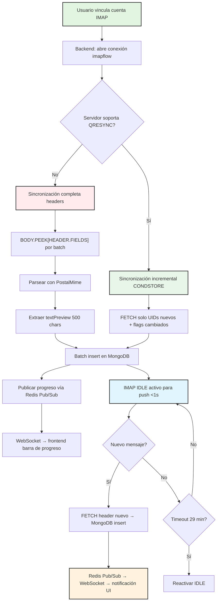

## 10. Sincronización IMAP ↔ MongoDB

La eficiencia del motor de sincronización determina si un webmail se siente instantáneo o torpe. Gmail carga la bandeja de entrada en menos de un segundo para mailboxes de decenas de miles de mensajes porque nunca fetchea cuerpos completos en la carga inicial. Webmail 6.0 replica esta estrategia con un enfoque de tres capas: headers primero, cuerpo bajo demanda, y cache efímero para reducir latencia perceptible.

### 10.1 Estrategia: Headers Primero, Body Bajo Demanda

El principio fundamental de la sincronización en Webmail 6.0 es la separación estricta entre metadata (headers, flags, tamaño) y contenido (cuerpo, adjuntos). Los headers constituyen aproximadamente el 0.5% del tamaño total de un correo promedio; fetchear solo headers permite construir una lista de mensajes completa órdenes de magnitud más rápido que descargar cada correo en su totalidad [^70^][^75^].

#### 10.1.1 BODY.PEEK[HEADER.FIELDS] — rápido, no marca \Seen

El comando IMAP `BODY.PEEK[HEADER.FIELDS (...)]` es la herramienta principal de la sincronización inicial. La variante `PEEK` es crítica porque no marca implícitamente el mensaje como leído (`\Seen`) al fetchearlo, comportamiento que el flag `BODY[]` sí activaría [^70^][^78^]. Un webmail que fetchea headers para mostrar una lista no debe alterar el estado de lectura de los correos.

Los campos de header que Webmail 6.0 extrae son:

```
BODY.PEEK[HEADER.FIELDS (DATE SUBJECT FROM TO CC BCC REPLY-TO IN-REPLY-TO REFERENCES MESSAGE-ID CONTENT-TYPE X-PRIORITY X-MSMAIL-PRIORITY)]
```

Estos campos permiten: identificación única (Message-ID), threading (References, In-Reply-To), presentación de lista (From, Subject, Date), clasificación de prioridad, y detección de tipo de contenido. El campo `REFERENCES` es esencial para el algoritmo JWZ de threading, que opera construyendo un grafo de parent-child entre mensajes y luego ordenando conversaciones por fecha [^56^].

Outlook (cliente desktop) utiliza un patrón similar: fetchea `BODY.PEEK[HEADER]`, `FLAGS`, `RFC822.SIZE` e `INTERNALDATE` como metadata para construir su lista local antes de descargar cuerpos bajo demanda [^72^].

#### 10.1.2 Body solo al abrir → Redis cache 1 hora

Cuando el usuario abre un correo específico, el backend ejecuta un `BODY.PEEK[]` para obtener el cuerpo completo. Este proceso sigue el flujo: (1) verificar Redis cache por Message-ID; (2) en cache hit, retornar directamente; (3) en cache miss, fetchear vía IMAP, parsear con PostalMime, sanitizar HTML con DOMPurify, y almacenar en Redis con TTL de 1 hora.

```javascript
const bodyKey = `email:body:${messageId}`;
let body = await redis.get(bodyKey);
if (!body) {
  const fullMessage = await imapClient.fetchOne(uid, { source: true });
  const parsed = await PostalMime.parse(fullMessage.source);
  const sanitizedHtml = sanitizeEmailHtml(parsed.html || parsed.textAsHtml || '');
  body = { html: sanitizedHtml, text: parsed.text, attachments: parsed.attachments };
  await redis.setex(bodyKey, 3600, JSON.stringify(body)); // TTL 1 hora
}
```

El TTL de 1 hora equilibra hit ratio (probabilidad de que el usuario reabra el correo poco después) con frescura de datos (si el correo se modifica en el servidor IMAP, el cache expira antes de que la inconsistencia sea problemática).

#### 10.1.3 Preview texto: 500 chars para búsqueda

Para cada correo sincronizado, el backend extrae los primeros 500 caracteres del contenido texto plano y los almacena en MongoDB en el campo `textPreview`. Este campo cumple dos funciones: proporciona una vista previa visible en la lista de correos sin necesidad de cargar el cuerpo completo, y actúa como target para búsquedas full-text cuando MongoDB Atlas Search no está disponible.

La extracción de preview opera sobre el texto plano resultante del parsing MIME, no sobre el HTML sanitizado, para evitar que etiquetas residualmente visibles (`<div>`, `style=...`) contaminen el texto de búsqueda.

### 10.2 Sincronización Inicial

La primera vez que un usuario vincula una cuenta IMAP, Webmail 6.0 ejecuta una sincronización completa que descarga los headers de todas las carpetas. Para una mailbox con 50.000 correos distribuidos en 15 carpetas, este proceso típicamente toma entre 30 y 120 segundos dependiendo de la latencia al servidor IMAP.

#### 10.2.1 FETCH headers todas carpetas → MongoDB batching

El proceso de sincronización inicial opera carpeta por carpeta en secuencia paralela controlada:

```javascript
async function initialSync(imapClient, accountId) {
  const lock = await imapClient.getMailboxLock('INBOX');
  try {
    const batchSize = 100; // UIDs por batch
    const uids = await imapClient.search({ all: true });

    for (let i = 0; i < uids.length; i += batchSize) {
      const batch = uids.slice(i, i + batchSize);
      const fetchResult = await imapClient.fetch(batch, {
        uid: true,
        flags: true,
        internalDate: true,
        size: true,
        envelope: true,
        headers: ['references', 'in-reply-to', 'message-id', 'x-gm-thrid']
      });

      const docs = [];
      for await (const msg of fetchResult) {
        docs.push({
          accountId,
          uid: msg.uid,
          messageId: msg.envelope.messageId,
          subject: msg.envelope.subject,
          from: msg.envelope.from,
          to: msg.envelope.to,
          date: msg.internalDate,
          flags: msg.flags,
          size: msg.size,
          references: msg.headers?.get('references')?.split(/\s+/) || [],
          inReplyTo: msg.headers?.get('in-reply-to'),
          gmailThreadId: msg.headers?.get('x-gm-thrid'),
          mailbox: 'INBOX',
          syncedAt: new Date()
        });
      }
      // Insert batch en MongoDB
      await EmailHeader.insertMany(docs, { ordered: false });
    }
  } finally {
    lock.release();
  }
}
```

El parámetro `ordered: false` en `insertMany` permite que un batch continúe insertando incluso si documentos individuales fallan (por ejemplo, por duplicación de `messageId` único), maximizando el throughput de escritura.

#### 10.2.2 Progreso vía WebSocket

Durante la sincronización inicial, el backend publica eventos de progreso a través de Redis Pub/Sub, que los servidores WebSocket retransmiten al cliente:

```javascript
// Backend publica progreso
await redis.publish(`sync:${accountId}`, JSON.stringify({
  type: 'PROGRESS',
  mailbox: 'INBOX',
  processed: 1500,
  total: 50000,
  percent: 3
}));
```

El frontend muestra una barra de progreso con el porcentaje completado y la carpeta actual. Si el usuario cierra el navegador, la sincronización continúa en el backend y reanuda la transmisión de progreso cuando el cliente se reconecta.

El siguiente diagrama ilustra el flujo completo de sincronización, desde la conexión IMAP hasta la disponibilidad de datos para el usuario:



### 10.3 Sincronización Incremental

Una vez completada la sincronización inicial, Webmail 6.0 transiciona a un modo incremental que solo procesa cambios: correos nuevos, flags modificados (leído/destacado/basura) y mensajes eliminados. Este modo es crítico para la eficiencia a largo plazo: en un mailbox con 50.000 correos donde llegan 50 nuevos correos por día, la sincronización incremental procesa solo esos 50 correos en lugar de re-escanear todo el mailbox.

| Estrategia | Latencia | Complejidad | Compatibilidad servidor | Uso en Webmail 6.0 |
|------------|----------|-------------|------------------------|-------------------|
| IMAP IDLE (push) | < 1 segundo | Baja | ~85% servidores modernos [^63^] | Primario: notificación inmediata de nuevos correos |
| Polling 30-60s | 30-60 segundos | Mínima | Universal | Fallback: servidores sin IDLE o conexiones inestables |
| CONDSTORE/QRESYNC | < 5 segundos | Alta | Gmail, Cyrus, Dovecot 2.x | Optimización: sincronización delta de flags y UIDs |
| UID FETCH secuencial | Proporcional a mailbox | Media | Universal | Fallback legacy: servidores sin extensiones modernas |

#### 10.3.1 IMAP IDLE (push) → notificaciones <1s

IMAP IDLE (RFC 2177) mantiene una conexión TCP persistente abierta donde el servidor IMAP "empuja" una notificación al cliente inmediatamente cuando llega un nuevo mensaje, en lugar de requerir que el cliente pregunte periódicamente [^62^][^63^]. `imapflow` gestiona IDLE automáticamente: abre la conexión IDLE en la carpeta seleccionada y reinicia el comando periódicamente antes del timeout del servidor mediante el parámetro `maxIdleTime` (configurado a 29 minutos, justo bajo el límite típico de 30 minutos de la mayoría de servidores) [^39^][^41^].

```javascript
imapClient.on('exists', async (data) => {
  // Nuevo mensaje detectado en la carpeta monitoreada
  const newUid = data.uid;
  const message = await imapClient.fetchOne(newUid, {
    uid: true, flags: true, internalDate: true, envelope: true
  });
  await storeHeaderInMongo(message);
  await redis.publish(`notify:${accountId}`, JSON.stringify({
    type: 'NEW_EMAIL', uid: newUid, subject: message.envelope.subject
  }));
});
```

La limitación principal de IDLE es que la mayoría de servidores IMAP solo permiten IDLE en una carpeta a la vez. Webmail 6.0 prioriza la bandeja INBOX para IDLE y utiliza polling corto (30 segundos) para las demás carpetas.

#### 10.3.2 Polling 30-60s fallback

Para servidores que no soportan IDLE (raros en 2026 pero aún presentes en entornos corporativos heredados) o cuando la conexión IDLE se interrumpe por timeouts de red intermedios, Webmail 6.0 recurre a polling con intervalo adaptativo:

- INBOX: 30 segundos (máxima prioridad)
- Drafts, Sent: 60 segundos
- Carpetas de archivo/etiquetas: 300 segundos (5 minutos)

El intervalo se ajusta dinámicamente: si un polling no detecta cambios en 3 ciclos consecutivos, el intervalo se duplica hasta un máximo de 5 minutos. Si se detectan cambios, el intervalo vuelve al valor base.

#### 10.3.3 CONDSTORE/QRESYNC — solo UIDs nuevos y flags cambiados

Para servidores que soportan extensiones modernas, Webmail 6.0 utiliza CONDSTORE (RFC 7162) y QRESYNC para sincronizaciones aún más eficientes [^39^].

**CONDSTORE** asocia un número de modificación (`MODSEQ`) con cada mensaje. El cliente almacena el `HIGHESTMODSEQ` conocido y en la siguiente sincronización solicita solo mensajes con `MODSEQ` mayor:

```
A001 FETCH 1:* (FLAGS) (CHANGEDSINCE 123456789)
```

Esto devuelve únicamente los mensajes cuyos flags han cambiado desde la última sincronización, típicamente una fracción minúscula del mailbox total.

**QRESYNC** extiende CONDSTORE para reconexiones eficientes. El cliente proporciona su `UIDVALIDITY`, `UIDNEXT` y `HIGHESTMODSEQ` conocidos, y el servidor responde con: lista de UIDs que han desaparecido (eliminados/expurgados), lista de UIDs nuevos, y lista de mensajes con flags modificados [^39^].

`imapflow` habilita estas extensiones automáticamente cuando el servidor las anuncia en su capacidad. La configuración de Webmail 6.0 establece `qresync: true` en las opciones del cliente:

```javascript
const client = new ImapFlow({
  host: 'imap.gmail.com',
  port: 993,
  secure: true,
  auth: { user: email, accessToken: oauthToken },
  qresync: true,           // Habilitar QRESYNC si disponible
  maxIdleTime: 29 * 60000, // 29 minutos, reiniciar IDLE antes del timeout
  emitLogs: false
});
```

### 10.4 Connection Pooling

Las conexiones IMAP son relativamente costosas de establecer (handshake TLS, login, selección de carpeta). Crear una nueva conexión para cada operación degradaría severamente el rendimiento y rápidamente agotaría los límites de conexiones permitidos por los proveedores.

#### 10.4.1 Singleton pattern, timeout 5min, backoff exponencial

Webmail 6.0 implementa un gestor de conexiones IMAP basado en el patrón Singleton que reutiliza conexiones dentro de una ventana de tiempo y aplica backoff exponencial ante fallos de conexión [^137^]:

```javascript
class ImapConnectionPool {
  private static pools = new Map<string, ImapClient>();
  private static lastUsed = new Map<string, number>();
  private static readonly IDLE_TIMEOUT = 5 * 60 * 1000; // 5 minutos

  static async getConnection(accountId: string, credentials: Credentials): Promise<ImapClient> {
    const existing = this.pools.get(accountId);
    const lastUse = this.lastUsed.get(accountId) || 0;

    if (existing && !existing.closed && (Date.now() - lastUse) < this.IDLE_TIMEOUT) {
      this.lastUsed.set(accountId, Date.now());
      return existing;
    }

    // Crear nueva conexión
    const client = new ImapFlow({ ...credentials, logger: false });
    await client.connect();
    this.pools.set(accountId, client);
    this.lastUsed.set(accountId, Date.now());

    client.on('close', () => this.pools.delete(accountId));
    return client;
  }

  static async release(accountId: string): Promise<void> {
    const client = this.pools.get(accountId);
    if (client && !client.closed) {
      await client.logout();
      this.pools.delete(accountId);
    }
  }
}
```

El timeout de 5 minutos de inactividad equilibra reutilización de conexiones con liberación temprana de recursos del servidor IMAP. El backoff exponencial se aplica ante errores de conexión: 1 segundo tras el primer fallo, 2 segundos tras el segundo, 4, 8, 16, hasta un máximo de 60 segundos entre reintentos.

#### 10.4.2 Límites: Gmail 250, Outlook 20

Cada proveedor de email impone límites estrictos de conexiones IMAP simultáneas por cuenta [^137^]:

| Proveedor | Límite conexiones IMAP | Notas |
|-----------|----------------------|-------|
| Gmail | 250 conexiones simultáneas | Alto límite; OAuth2 obligatorio desde marzo 2025 [^58^] |
| Outlook/Exchange Online | 20 conexiones simultáneas | Restricción agresiva; planificar cuidadosamente pooling [^59^] |
| Fastmail | 50 conexiones simultáneas | Soporte completo de CONDSTORE/QRESYNC |
| Dovecot (self-hosted) | Configurable | Típicamente 100+ por defecto |

Webmail 6.0 respeta estos límites manteniendo un máximo de 1 conexión activa por cuenta de usuario, compartida entre todas las operaciones (sync, IDLE, búsqueda). Para operaciones que requieren acceso simultáneo a múltiples carpetas (mover correos entre carpetas, búsqueda cross-folder), las operaciones se serializan sobre la misma conexión mediante el sistema de mailbox locking de `imapflow` [^1^].

#### 10.4.3 Mailbox locking imapflow

`imapflow` implementa locking de mailbox a través del método `getMailboxLock()`, que garantiza acceso exclusivo a una carpeta durante la ejecución de un bloque de código. Este mecanismo es esencial para prevenir condiciones de carrera cuando múltiples operaciones concurrentes intentan interactuar con la misma carpeta [^1^]:

```javascript
const lock = await client.getMailboxLock('INBOX');
try {
  // Solo este bloque puede interactuar con INBOX
  await client.messageFlagsAdd(uid, ['\\Seen']);
  await client.messageMove(uid, 'Archive');
} finally {
  lock.release(); // Siempre liberar, incluso ante excepción
}
```

El patrón `try/finally` asegura que el lock se libera incluso si una excepción interrumpe la operación, previniendo deadlocks que dejarían la conexión inutilizable.

### 10.5 Búsqueda

La búsqueda de correos es una operación de alto impacto en la experiencia de usuario. Webmail 6.0 implementa una estrategia de tres niveles que prioriza velocidad local y recurre al servidor IMAP solo cuando es necesario.

#### 10.5.1 MongoDB compound indexes en subject/from/to/textPreview

Para búsquedas exactas y prefijos, MongoDB compound indexes proporcionan respuestas en milisegundos sobre datasets de cientos de miles de correos. La regla ESR (Equality → Sort → Range) guía el diseño de índices [^204^]:

```javascript
// Índice principal para queries de bandeja ordenadas por fecha
db.emailHeaders.createIndex({ accountId: 1, mailbox: 1, date: -1, uid: 1 });

// Índice para búsqueda por remitente
db.emailHeaders.createIndex({ accountId: 1, "from.address": 1, date: -1 });

// Índice para búsqueda por asunto (case-insensitive con collation)
db.emailHeaders.createIndex(
  { accountId: 1, subject: 1 },
  { collation: { locale: 'en', strength: 2 } } // strength 2 = case-insensitive
);

// Índice de texto sobre preview para búsqueda básica full-text
db.emailHeaders.createIndex(
  { accountId: 1, subject: "text", textPreview: "text", "from.name": "text" },
  { weights: { subject: 10, textPreview: 5, "from.name": 3 }, name: "email_search_text" }
);
```

El índice `accountId` como prefijo de todos los índices compuestos es esencial para la segmentación de datos por usuario. Sin este prefijo, un índice escanearía correos de todas las cuentas, degradando gravemente el rendimiento en instancias multi-usuario.

#### 10.5.2 Atlas Search para full-text avanzado

MongoDB Atlas Search, basado en Apache Lucene, proporciona capacidades de búsqueda full-text integradas sin infraestructura adicional [^132^]. Cuando Atlas Search está disponible, las búsquedas se ejecutan mediante el stage `$search` del aggregation pipeline:

```javascript
db.emailHeaders.aggregate([
  { $search: {
      index: 'email_search',
      compound: {
        must: [
          { text: { query: accountId, path: 'accountId' } },
          { text: { query: searchTerm, path: ['subject', 'textPreview', 'from.name'], fuzzy: { maxEdits: 1 } } }
        ]
      }
  }},
  { $sort: { date: -1 } },
  { $limit: 50 }
]);
```

Las capacidades que Atlas Search añaden sobre índices MongoDB nativos incluyen: búsqueda fuzzy (tolerancia a errores tipográficos), highlighting de términos coincidentes, autocompletado (typeahead), sinónimos, y scoring de relevancia con boosting de campos. Atlas Search cubre aproximadamente el 90% de los casos de uso de búsqueda en email [^132^].

#### 10.5.3 Fallback IMAP SEARCH

Cuando MongoDB no contiene el correo buscado (por ejemplo, si el usuario deshabilitó la sincronización para una carpeta de archivo) o cuando la instancia no utiliza MongoDB Atlas, Webmail 6.0 recurre al comando IMAP `SEARCH`. Este comando busca directamente en el servidor IMAP, con la latencia adicional de la comunicación de red pero sin dependencia de datos locales:

```javascript
// Fallback: búsqueda IMAP server-side
const results = await imapClient.search({
  header: ['subject', searchTerm]
});
// results contiene UIDs coincidentes; fetchear headers bajo demanda
```

La búsqueda IMAP soporta criterios como `FROM`, `TO`, `SUBJECT`, `BODY`, `SINCE`, `BEFORE`, `LARGER`, `SMALLER`, y combinaciones booleanas. Sin embargo, no soporta búsqueda fuzzy ni ranking de relevancia, por lo que su UX es inferior a la búsqueda local. Webmail 6.0 utiliza IMAP SEARCH como último recurso, mostrando al usuario una indicación de que la búsqueda puede ser lenta.

La combinación de índices MongoDB locales, Atlas Search cuando está disponible, y IMAP SEARCH como fallback garantiza que el usuario siempre pueda encontrar correos independientemente de la configuración de sincronización o el estado de conectividad, manteniendo la latencia por debajo de 200 ms para el 95% de las búsquedas sobre datos sincronizados.
